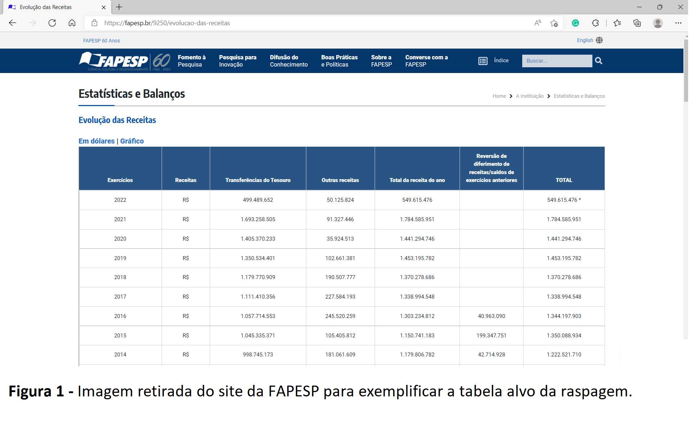
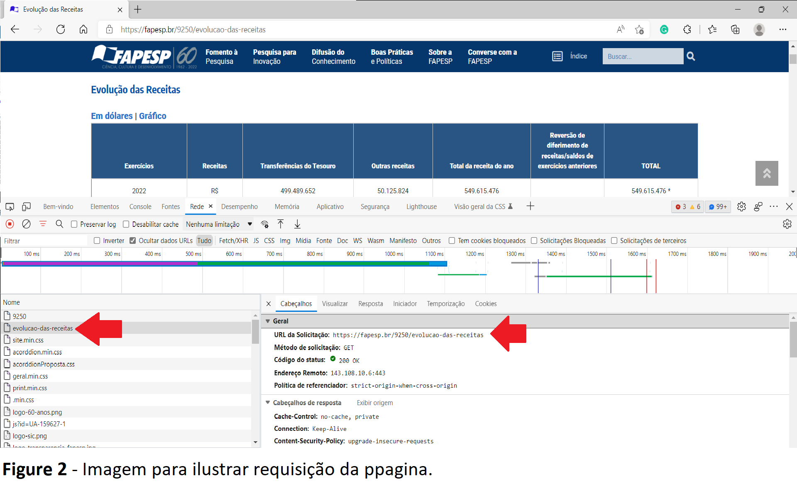
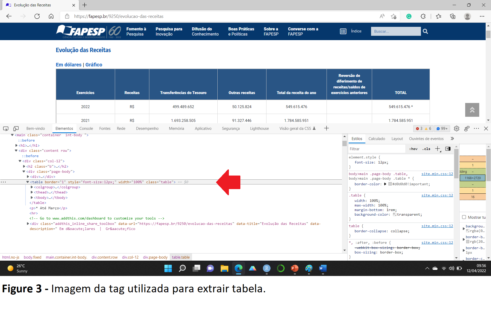
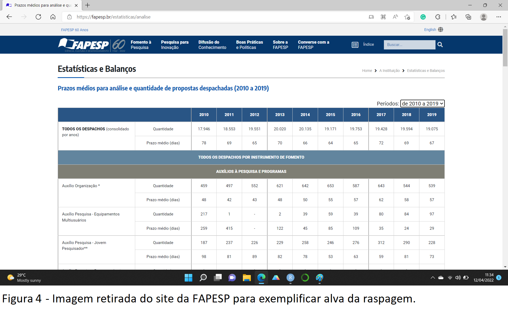
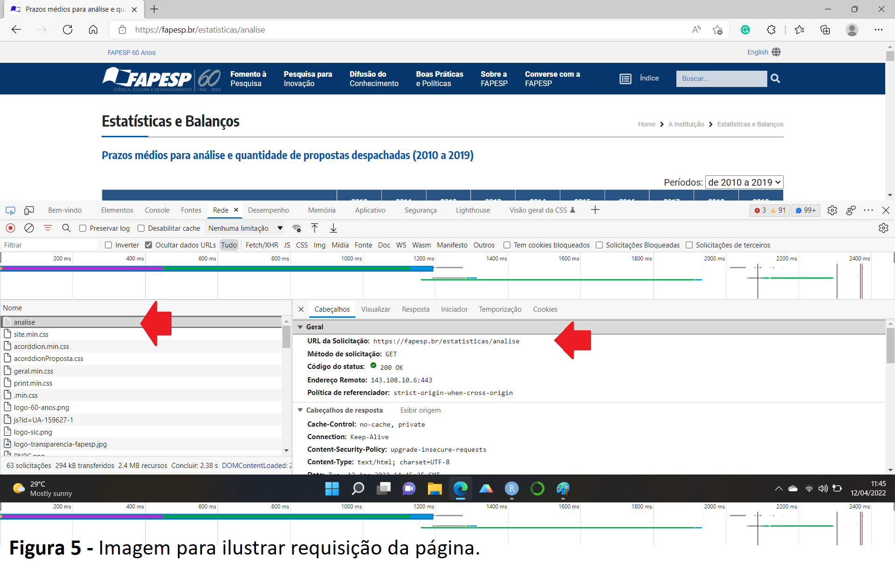
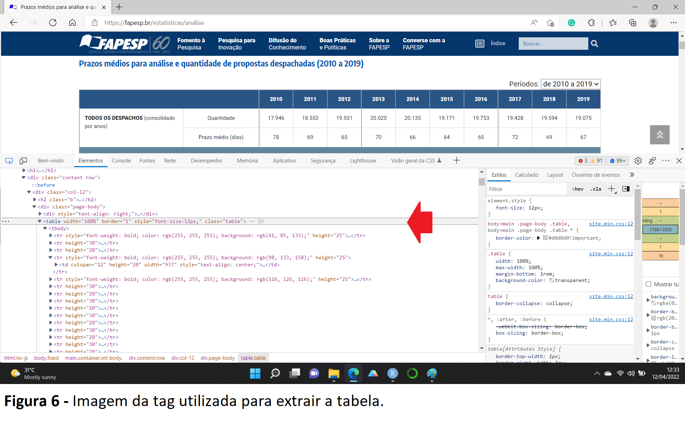

```{r setup, include=FALSE}
knitr::opts_chunk$set(echo = TRUE)
```

# Quem é a FAPESP?

A FAPESP - Fundação de Amparo à Pesquisa do Estado de São Paulo - é uma das principais agências de fomento à pesquisa científica e tecnológica do país. Com autonomia garantida por lei, a FAPESP está ligada à Secretaria de Desenvolvimento Econômico.

Com um orçamento anual correspondente a 1% do total da receita tributária do Estado, a FAPESP apoia a pesquisa e financia a investigação, o intercâmbio e a divulgação da ciência e da tecnologia produzida em São Paulo.

Para ilustrar a receita e a quantidade de despachos realizados pela FAPESP, foi realizada a raspagem dos dados de 2 tabelas disponíveis no site da FAPESP.

# Vamos trabalhar - Pacotes necessários
```{r message=FALSE, warning=FALSE}
# Carregando pacotes --------------------------------------------------------------------------
library(tidyverse)
library(httr)
library(xml2)
library(rvest)

#  Tirar conotação cientifica ------------------------------------------------------------------

options(scipen = 999)

```


# Primeiro passo - Raspando as informações sobre as receitas da FAPESP

No próprio site da [FAPESP](https://fapesp.br/9250/evolucao-das-receitas) há uma seção com as estatisticas da instituição. Na seção que detalha as receitas da FAPESP há uma tabela contendo todas as receitas. Esta tabela (Figura 1) foi a primeira motivação para a raspagem dos dados


```{r echo=FALSE}

```
Para extrair os dados da tabela foi realizada a inspeção do HTML para verificar a forma de requisição. Na aba "rede" nota-se que o primeiro item **evolução-das-receitas** apresenta bastante requisições e tem um conteudo do tipo html. Ainda, ao inspecionar a aba "visualizar" notei que a tabela esta presente neste objeto, me dando indícios que a requisição deste item me permitiria chegar a tabela alvo. A requisição deste item é do tipo *GET* e o *Status* deve ser 200.          

```{r echo=FALSE}

```

```{r}
# GET URL -------------------------------------------------------------------------------------

url_fapesp <- "https://fapesp.br/9250/evolucao-das-receitas"

get_url_fapesp <- httr::GET(url_fapesp)

# verificando status da requisição

get_url_fapesp

```
Conforme podemos observar, a requisição foi realizada com sucesso. Em seguida, ainda nas ferramentas de desenvolvedor, mas agora na aba **elementos**, ao clicar na tabela, identifiquei a tag **table** (Figure 3) e, investi uma tentativa nela para ver se conseguia extrair a tabela.

```{r echo=FALSE}

```

Após ler o html, busquei a tag **table** e, utilizadno a função *rvest::html_table* verifiquei que obtive sucesso em acessar a tabela de receitas da FAPESP. Contudo, ainda era necessário organizar a tabela visto que as colunas númerivas vieram como strings.  

```{r}
# Scraping o html --------------------------------------------------------------------------------

tb_fapesp <-
  get_url_fapesp |>
  read_html() |>
  xml_find_all(xpath = "//table") |>
  rvest::html_table(header = TRUE)

head(tb_fapesp)
```

Para limpeza da tabela foi utilizada funções para ajustar o nome das variáveis, extrair pontos entre os números e conversáo do tipo da variável. Após os ajustes,nota-se que as colunas agora apresentam tipo e nome adequado para análise.   

```{r}
# Arrumando a base de dados

fapesp_arrumada <- tb_fapesp[[1]] |>
  janitor::clean_names() |> # arrumando os nomes
  mutate( # tirando o ponto dos vetores de caracteres para converter em numeric
    transferencias_do_tesouro = as.numeric(str_remove_all(transferencias_do_tesouro,
                                                          pattern = "[.]")),
    outras_receitas = as.numeric(str_remove_all(outras_receitas,
                                                pattern = "[.]")),
    total_da_receita_do_ano = as.numeric(str_remove_all(total_da_receita_do_ano,
                                                        pattern = "[.]")),
    reversao_de_diferimento_de_receitas_saldos_de_exercicios_anteriores = as.numeric(str_remove_all(reversao_de_diferimento_de_receitas_saldos_de_exercicios_anteriores,
                                                                                                    pattern = "[.]")),
    total = as.numeric(str_remove_all(total,
                                      pattern = "[.]"))
  ) |>
  dplyr::mutate(
    total = total/1000000,
  )

glimpse(fapesp_arrumada)
```
Segue abaixo documentação tabela obtida:

**exercicios** = ano da receita;

**receitas** = moeda no qual a receita foi recebida;

**transferencias_do_tesouro** = recurso com origem do tesouro;

**outras_receitas** = valor obtido por meio de outros recursos; 

**total_da_receita_do_ano** = total da receita no ano;

**reversao_de_diferimento_de_receitas_saldos_de_exercicios_anteriores** = recurso recebido por meio de reversão de diferimento de receitas/saldo de anos anteriores;

**total** = total da receita no ano;


Por fim, foi criado um .csv da base de dados organizada.

```{r}
# Criando um .csv  ----------------------------------------------------------------------------

fapesp_arrumada |>
  filter(exercicios >= 1994 & exercicios < 2022) |>
  write_csv(file = "adjusted_data/fapesp_receitas_1994_2021.csv")
```

# Segundo passo - Raspando as informações sobre os despachos da FAPESP

Ainda no site da FAPESP, mas agora na página onde se encontra as informações sobre [Prazos médios para análise e quantidade de propostas despachadas (2010 a 2019)](https://fapesp.br/estatisticas/analise) também há uma tabela (Figura 4). Esta tabela, em particular a parte que detalha todos os despachos foi a segunda motivação para a raspagem dos dados.

```{r echo=FALSE}

```
Em seguida, foi realizada a inspeção do HTML para verificar a forma de requisição. Na aba "rede" verifiquei que o primeiro item **https://fapesp.br/estatisticas/analise** também apresentava bastante requisições e tinha conteudo do tipo html, dando indício que a requisição deste item me daria a tabela alvo. A requisição deste item é do tipo *GET* e o *Status* deve ser 200.          

```{r echo=FALSE}

```

```{r}
# GET URL -------------------------------------------------------------------------------------

url_fapesp_despacho <- "https://fapesp.br/estatisticas/analise"

get_url_fapesp_despacho <- httr::GET(url_fapesp_despacho)

# verificando status da requisição

get_url_fapesp_despacho
```

Conforme podemos observar, a requisição foi realizada com sucesso. Desta vez, a requisição devolvia um json. Em seguida inspecionei o HMTL e, novamente, busquei a tag **table** conforme identificado na página (Figure 6) e a tabela anteriormente extraida.

```{r echo=FALSE}

```

Já com o exemplo da tabela anterior, fiz a checagem do html e busquei a tag **table** utilizando a função *rvest::html_table* e, novamente, obtive sucesso em acessar a tabela que, assim como a outra tabela, também precisa de uma faxina.  

```{r}

# Scraping o html ------------------------------------------------------------------------------

get_url_fapesp_despacho <-
  get_url_fapesp_despacho |>
  read_html() |>
  xml_find_all(xpath = "//table") |>
  rvest::html_table(header = TRUE) |>
  purrr::pluck(1)

head(get_url_fapesp_despacho)

```

Para limpeza da tabela foi utilizada funções para ajustar o nome das variáveis, extrair pontos entre os números e conversáo do tipo da variável e pivotagem. Após os ajustes pode-se observar que as colunas agora apresentam tipo e nome adequado para análise do total de despachos por ano. 

```{r}
# Arrumando a base - TOTAL DE DESPACHOS

total_despachos <-
   get_url_fapesp_despacho[1:2,2:12] |>
   janitor::clean_names() |>
   mutate(
     x2010 = as.numeric(x2010),
     x2011 = as.numeric(x2011),
     x2012 = as.numeric(x2012),
     x2013 = as.numeric(x2013),
     x2014 = as.numeric(x2014),
     x2015 = as.numeric(x2015),
     x2016 = as.numeric(x2016),
     x2017 = as.numeric(x2017),
     x2018 = as.numeric(x2018),
     x2019 = as.numeric(x2019)
   ) |>
     pivot_longer(cols = !x,names_to = "Ano",values_to = "Quantidade") |>
     mutate(
       Ano = as.factor(str_remove_all(string = Ano, pattern = "[x]")),
       Quantidade = as.numeric(Quantidade*1000)
       ) |>
  rename(
   despachos = x
  )

glimpse(total_despachos)

```

Segue abaixo documentação tabela obtida:

**despachos** = quantidade ou prazo de despachos por ano;

**Ano** = Ano referência;

**Quantidade** = quantidade total ;

Por fim, foi criado um .csv da base de dados organizada.

```{r}
# Criando um .csv -----------------------------------------------------------------------------

total_despachos |>
  write_csv(file = "adjusted_data/fapesp_despachos_2010-2019.csv")

```

# Verificando a receita da FAPESP

Como podemos verificar no gráfico abaixo, a FAPESP apresenta uma progressiva receita desde 1994, indicando um progressivo investimento na ciência. 

```{r echo=FALSE, message=FALSE, warning=FALSE}
# Lendo a base --------------------------------------------------------------------------------
df <- readr::read_csv("adjusted_data/fapesp_receitas_1994_2021.csv")

# Plot ----------------------------------------------------------------------------------------

g <-
  df |>
  ggplot2::ggplot(ggplot2::aes(x = as.character(exercicios))) +
  ggplot2::geom_col(
    ggplot2::aes(y = total),
    size = 1,
    fill = "blue",
    alpha = .4
  ) +
  ggplot2::geom_line(
    ggplot2::aes(y = total),
    group = 1,
    size = 3.5,
    color = "white"
  ) +
  ggplot2::geom_line(
    ggplot2::aes(y = total,
                 lty = "Evolução anual das Receitas - 1994 a 2011(R$)"),
    group = 1,
    size = 1.2,
    color = "blue"
  ) +
  ggplot2::scale_y_continuous("Milhões de reais (R$)") +
  ggplot2::theme(
    text = ggplot2::element_text(size = 20, family = "Times New Roman"),
    axis.title.x = ggplot2::element_blank(),
    axis.title.y.left = ggplot2::element_text(size = 12),
    axis.ticks.y = ggplot2::element_blank(),
    panel.background = ggplot2::element_rect(fill = "white"),
    axis.line.x.bottom = ggplot2::element_line(size = 1),
    axis.line.y.left = ggplot2::element_line(size = 1),
    panel.grid.major.y = ggplot2::element_line(size = 0.5, color = "gray95"),
    panel.grid.minor.y = ggplot2::element_line(size = 0.5, color = "gray95"),
    axis.text.y = ggplot2::element_text(size = 12),
    axis.text.x = ggplot2::element_text(
      size = 12,
      angle = 45,
      hjust = 1
    ),
    axis.ticks.x = ggplot2::element_line(size = 1),
    axis.ticks.y.left = ggplot2::element_line(size = 1),
    axis.ticks.length = ggplot2::unit(.25, "cm"),
    legend.text = ggplot2::element_text(size = 18),
    legend.key = ggplot2::element_blank(),
    legend.title = ggplot2::element_blank(),
    legend.position = "top",
    legend.justification = "center",
    plot.caption = ggplot2::element_text(size = 12, color = "gray50"),
  ) +
  ggplot2::labs(caption = "https://fapesp.br/9250/evolucao-das-receitas")

g

```

# Quantidade e prazo média em dias para despacho de resultados da FAPESP

Com o aumento das receitas anuais é de se esperar que a FAPESP apresente também uma elevada demanda de trabalho para avaliar e responder a pesquisadores fazendo pedidos de financiamento.
Realmente, podemos observar uma quantidade elevada de despachos pela FAPESP. Esses despachos acontecem em aproximadamente 70-60 dias após a submissão. 

```{r echo=FALSE, message=FALSE, warning=FALSE}
# Lendo a base --------------------------------------------------------------------------------
df2 <- read.csv(file = "adjusted_data/fapesp_despachos_2010-2019.csv",
                encoding = "UTF-8")

# Plot ----------------------------------------------------------------------------------------

# Total de Despachos

g2 <-
  df2 |>
    dplyr::filter(despachos == "Quantidade") |>
    ggplot2::ggplot(ggplot2::aes(
    x = as.factor(Ano),
    y = Quantidade,
    colour = "white",
    fill = Ano
  )) +
  ggplot2::geom_col(show.legend = FALSE) +
  viridis::scale_color_viridis(discrete = TRUE) +
  viridis::scale_fill_viridis(discrete = FALSE) +
  ggplot2::labs(title = "TOTAL DE DESPACHOS REALIZADOS PELA FAPESP",
       subtitle = "De 2010 à 2019") +
  ggplot2::xlab("Ano") +
  ggplot2::theme_classic() +
  ggplot2::theme(text = ggplot2::element_text(size = 12,
                                     family = "Times New Roman"),
        plot.title = ggplot2::element_text(hjust = 0.5),
        plot.subtitle = ggplot2::element_text(hjust = 0.5))
g2

# Prazo m?dio para o Despacho

g3 <-
  df2 |>
  dplyr::filter(despachos == "Prazo médio (dias)") |>
  dplyr::mutate(
    Quantidade = Quantidade/1000
  ) |>
  ggplot2::ggplot(ggplot2::aes(
    x = as.factor(Ano),
    y = Quantidade,
    colour = "white",
    fill = Ano
  )) +
  ggplot2::geom_col(show.legend = FALSE) +
  viridis::scale_color_viridis(discrete = TRUE) +
  viridis::scale_fill_viridis(discrete = FALSE) +
  ggplot2::labs(title = "PRAZO MÉDIO (DIAS) PARA DESPACHO REALIZADOS PELA FAPESP",
       subtitle = "De 2010 à 2019",
       caption = "https://fapesp.br/estatisticas/analise") +
  ggplot2::xlab("Ano") +
  ggplot2::ylab("Número de dias") +
  ggplot2::theme_classic() +
  ggplot2::theme(text = ggplot2::element_text(size = 12,
                                     family = "Times New Roman"),
        plot.title = ggplot2::element_text(hjust = 0.5),
        plot.subtitle = ggplot2::element_text(hjust = 0.5))
g3

```
# CONSIDERAÇÕES FINAIS

Após realizada a raspagem das informações podemos observar o crescente aumento da receita da FAPESP, mostrando um incentivo do estado na pesquisa cientítica. Cumpre destacar que mesmo nos 2 últimos anos, com as incertezas causadas pela pandemia da COVID-19 e cortes do governo federal ainda assim houve um aumento da receita. É claro esses aumentos demonstram incentivo do estado, mas numa perspectiva de desenvolvimento do país e considerando que o estado de São Paulo tem uma das maiores arrecadações do país, não é nada demais especular maiores investimentos do que os atuais 1%.


